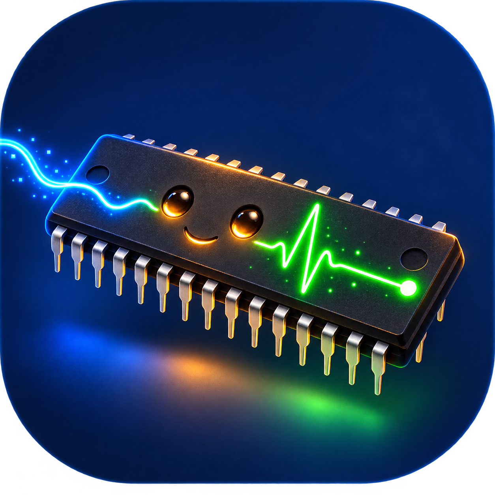

# pi86-rp2350

<p align="center">
  
</p>

> **pi86-rp2350 is a host-managed bare-metal processor runtime for a real NEC V30.**
>
> **Host-Managed Bare-Metal Physical Processor Runtime**
> *A modern remote-processor runtime for a vintage physical CPU.*

The NEC V30 is not emulated. It executes native x86-class machine code and owns
its registers, control flow, interrupts, faults, and results. A modern Host
loads and supervises that work. The RP2350 connects the two worlds by owning the
physical bus and the shared resources around the processor.

<p align="center">
  
</p>

<p align="center">
  <em>Physical NEC D70116C-8 on the original Pi86 V20/V30 HAT, connected to a Waveshare RP2350-PiZero.</em>
</p>

## 🧠 Why is this interesting?

Most retro-computing projects either recreate the computer that once surrounded
an old processor or emulate that processor in modern software. `pi86-rp2350`
asks a different question:

> **Can a real vintage CPU become a physical processor that a modern Host can
> load, communicate with, supervise, and restart—without first rebuilding a
> traditional PC around it?**

The V30 knows nothing about USB, Python, FAT filesystems, or AI. It only knows
its native instruction set, interrupts, and physical bus. The Host does not
pretend to be the V30 or execute instructions for it. Instead, the RP2350
bridges those two worlds: modern control and shared resources on one side, real
native execution on forty-year-old silicon on the other.

That changes the role of the processor. The V30 is no longer confined to being
the CPU of a reconstructed PC, and it is not reduced to a software model. It
becomes a bare-metal physical execution target inside a modern runtime.

> **This project is not only about making an old CPU boot again. It explores a
> new way for that CPU to remain useful, observable, and alive.**

## 📖 Story and motivation

This project began as a hardware bring-up: connect the original Pi86 V20/V30
HAT to an RP2350-PiZero and find out whether a real NEC V30 could reliably
leave RESET, fetch its first instruction, and execute native code.

Then the processor said hello. It learned to read and write memory. It
exchanged a physical message with a modern Host. Finally, instead of being
stopped after a test, it remained alive in `STI`/`HLT`, waking through real
interrupt acknowledge cycles, answering, and returning to sleep.

Those experiments changed the question. Reconstructing another fixed PC was no
longer the most interesting destination. The more compelling idea was to let
the physical V30 leave that historical machine behind while keeping the part
that matters: the real processor, executing its own native instructions.

That is the motivation for the runtime described here. A modern Host provides
loading, files, communication, supervision, and recovery. The RP2350 provides
the physical resources and bus discipline. The V30 is free to do the one thing
only it can do: execute as a real V30.

## ⚙️ The runtime

```text
Host
= runtime controller
  load / run / stdio / files / status / timeout / restart
             |
             | USB control, data, and observation
             v
RP2350
= companion resource and bus controller
  memory / storage / mailbox / interrupt / clock / reset / PIO / DMA
             |
             | physical multiplexed V30 bus
             v
NEC V30
= bare-metal remote physical processor
  native workload execution
```

The responsibility split is fixed:

> **The Host manages the runtime. The RP2350 owns shared resources and the
> physical bus. The real NEC V30 executes bare-metal native workloads.**

Operationally:

```text
load -> run -> communicate -> observe -> exit / fault / timeout -> restart
```

This is not an x86 emulator, a PC/XT clone, or a BIOS/DOS-first computer. BIOS,
DOS, ELKS, and PC-compatible devices may still be loaded as experiments, but
they are not prerequisites and do not define the project.

## 🖥️ What the Host provides

The reference Python runtime is a small remote shell. Its stable command model
includes:

- workload loading, launch, stop, and restart;
- stdin/stdout and mailbox communication;
- file operations on RP2350-owned FAT volumes;
- V30-visible memory inspection and transfer;
- liveness, status, `top`, trace, timeout, and fault reporting.

Python is the first client, not the architecture. C, Rust, Web tools,
ChatGPT/Codex, and other clients can use the same Host Protocol.

The Host may disappear without becoming part of a current V30 bus cycle. A
workload can crash or stop responding; the runtime reports it, preserves
available evidence, and lets the user restart it.

## 💾 Resource model

The RP2350 is the single low-level owner. Host and V30 share content through it,
not raw controllers or filesystem metadata.

| Resource | Runtime role |
|---|---|
| RP2350 Internal SRAM | firmware, PIO/DMA state, mailbox, cache/prepared windows, short traces |
| External PSRAM | principal V30 execution memory and Host/V30 shared volatile workspace |
| External NOR Flash | firmware/reserved region plus the shared `flash:` FAT volume |
| SD Card | optional removable `sd:` FAT volume |

Example shared paths:

```text
flash:/workloads/hello.bin
flash:/results/output.txt
sd:/datasets/input.dat
sd:/traces/run001.log
```

The V30 sees assigned memory and runtime services; it never directly owns USB,
PSRAM, NOR Flash, SD, FAT, PIO, or DMA controllers.

## ⏱️ Physical timing boundary

The original Pi86 HAT keeps V30 `READY` asserted. Timing-critical bus behavior
therefore remains in PIO/DMA and prepared RP2350 state. Host software, USB,
filesystem work, and arbitrary storage transactions do not answer an active
V30 bus cycle.

General PSRAM-backed arbitrary execution is the next major physical integration
gate. The architecture and Host shell are defined, but documentation does not
claim that this hardware path has already passed validation.

## 🔌 Hardware baseline

- Waveshare RP2350-PiZero with Raspberry Pi RP2350B
- physical NEC V30 `D70116C-8` / `uPD70116C-8`
- original Homebrew8088 Pi86 V20/V30 HAT
- Raspberry Pi-compatible 40-pin physical interface
- 16 MB External NOR Flash
- External PSRAM footprint/device for the target runtime
- native USB HID/CDC Host interface
- optional SD Card

The installed V30 is nominally a 5 V device. Operation on the original Pi86 HAT
at 3.3 V is a project-specific empirical condition, not the nominal NEC
specification.

## 📚 Documentation

- [`docs/architecture.md`](docs/architecture.md) — canonical system architecture
- [`docs/host_runtime_architecture.md`](docs/host_runtime_architecture.md) — detailed runtime and resource contract
- [`docs/host_runtime_shell.md`](docs/host_runtime_shell.md) — Host shell command model
- [`docs/memory_architecture.md`](docs/memory_architecture.md) — memory and shared-storage ownership
- [`docs/host_protocol.md`](docs/host_protocol.md) — language-independent Host Protocol
- [`docs/hardware_contract.md`](docs/hardware_contract.md) — physical interface contract
- [`docs/validation/`](docs/validation/) — accepted physical evidence
- [`docs/archive/`](docs/archive/) — superseded plans and former project directions
- [`docs/README.md`](docs/README.md) — complete documentation map

The current architecture decision is
[`ADR 0008`](docs/adr/0008-adopt-host-managed-bare-metal-processor-runtime.md).

## 🙏 Lineage and acknowledgements

`pi86-rp2350` builds on the
[Homebrew8088 Pi86 project](https://www.homebrew8088.com/home/raspberry-pi-second-project)
and its physical V20/V30 HAT. Pi86 established the physical-processor concept;
this project moves bus timing into RP2350 PIO/DMA and turns the surrounding
system into a modern Host-managed runtime.
