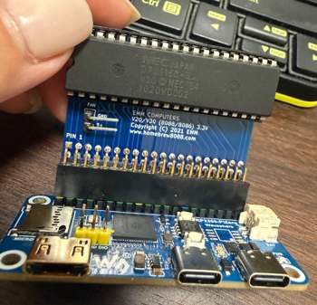

# pi86-rp2350

**A real NEC V30, with Raspberry Pi RP2350 PIO and DMA acting as its programmable chipset.**

`pi86-rp2350` evolves the original Pi86 physical V20/V30 computer into a Raspberry Pi RP2350-based **V30 companion-chip architecture**.

The project preserves the **physical NEC V30 CPU** while moving clock generation, bus control, ROM/RAM service, interrupt/timer peripherals, storage, display, and debugging into a bare-metal Raspberry Pi RP2350 system.

The **current implementation targets the NEC V30**; V20 remains part of the original Pi86 compatibility lineage and reference model.

This is **not** an x86 emulator running on the RP2350.

<p align="center">
  
</p>

<p align="center">
  <em>Physical NEC D70116C-8 (V30) on the original Pi86 V20/V30 HAT, connected to a Waveshare RP2350-PiZero.</em>
</p>

```text
Physical NEC V30
        +
PIO / DMA bus engine
        +
dual-core workload partitioning
        +
software-defined peripherals
        =
programmable V30 companion chipset
```

## Architecture thesis

The Raspberry Pi RP2350 is treated as a **programmable chipset**, not as a faster Linux host running Pi86-style GPIO polling.

The central engineering question is:

> How far can an RP2350 act as a programmable chipset around a real NEC V30 — from reset-vector execution through ROM, RAM, peripherals, BIOS services, and eventually a bootable PC-class system?

The core design rule is:

> **Keep the V30-critical timing path in PIO/DMA; move everything else progressively outward to the Arm cores and service layer.**

That creates a deliberate hierarchy:

```text
PIO / DMA       = hard real-time data path
Real-time core  = timing-sensitive supervision
Service core    = non-real-time system services
```

### Why PIO matters

RP2350 PIO is the key architectural enabler of this project.

Unlike software-driven GPIO polling, PIO state machines can execute tightly timed I/O sequences independently of the Arm cores. This keeps the V30 bus-critical path deterministic while address decoding, supervision, storage, debugging, and other higher-level services run outside that path.

In this design:

- **PIO0** generates and observes timing-critical bus phases
- **PIO1** owns direct V30 AD-bus response timing
- **DMA** feeds PIO without placing the Arm cores on the critical data path
- **Arm cores** supervise, decode, refill, and service work that cannot remain entirely in the deterministic PIO/DMA path

**PIO provides hardware-like timing with software-defined behavior.** That boundary is what makes the RP2350 useful here as a programmable chipset rather than merely as an MCU performing GPIO control.

### Dual-core partitioning

The two RP2350 Arm cores are intentionally separated by responsibility so higher-level services do not interfere with V30 bus timing.

- **Real-time core** — supports the deterministic bus path: address/control decode, fast supervision, refill coordination, and exceptional timing-sensitive work that cannot remain entirely in PIO/DMA
- **Service core** — handles non-time-critical services such as USB/debug, keyboard, storage, display, and ROM/disk image management

PIO and DMA remain on the hardest real-time path; dual-core partitioning keeps supervisory and service workloads from becoming part of that critical timing loop.

```text
                     +----------------------+
                     |     Physical V30     |
                     |    NEC D70116C-8     |
                     +----------+-----------+
                                |
                         V30 system bus
                                |
                    Original Pi86 V20/V30 HAT
                                |
                                v
              +------------------------------------+
              |        Waveshare RP2350-PiZero     |
              |      Raspberry Pi RP2350B MCU      |
              |                                    |
              |  PIO0  clock / passive observe     |
              |  PIO1  AD bus response             |
              |  DMA   deterministic transfers     |
              |                                    |
              |  real-time core   bus supervision  |
              |  service core     system services  |
              +------+-----------+----------+------+
                     |           |          |
                     v           v          v
                  SRAM        PSRAM       Flash
                     |           |          |
                fast path     V30 RAM      BIOS
                PIO/DMA       video        ROM
                queues        trace        firmware
```

The current HAT holds V30 `READY` high, so the present hardware cannot insert arbitrary wait states for ROM-cache misses, PSRAM latency, or slower peripheral service. **Deterministic response latency is therefore a first-class architectural constraint.**

The Raspberry Pi **physical 40-pin header position** is treated as the cross-platform hardware ABI. See [`docs/hardware_contract.md`](docs/hardware_contract.md) for the canonical mapping and review rules.

## Hardware baseline

- **Host board:** Waveshare RP2350-PiZero
- **MCU / programmable chipset:** Raspberry Pi RP2350B
- **CPU:** NEC V30 `D70116C-8` / `uPD70116C-8`
- **Installed CPU marking:** `1020VD002`
- **CPU interface:** original Homebrew8088 Pi86 V20/V30 HAT
- **Mechanical interface:** Raspberry Pi-compatible physical 40-pin header
- **Current HAT:** retained as the physically validated golden reference
- **Future hardware:** one consolidated V3.0 buffered companion-chip board with the legacy 40-pin data plane and a separate real-time control connector
- **External RAM target:** APS6404L-class 8 MB PSRAM
- **Onboard Flash:** 16 MB
- **Storage target:** onboard MicroSD
- **Display target:** onboard DVI using Pi86 virtual CGA memory
- **Debug target:** native USB CDC

> The installed `D70116C-8` is nominally a 5 V device. Operation on the original Pi86 HAT at 3.3 V is treated as a project-specific empirical condition rather than the nominal NEC operating specification.

Board-level reference: [Waveshare RP2350-PiZero Wiki](https://www.waveshare.com/wiki/RP2350-PiZero).

## Memory and peripheral model

The project separates three memory roles:

> **Internal SRAM = deterministic fast path**  
> **External PSRAM = V30 bulk working memory**  
> **Flash = persistent firmware / BIOS / ROM storage**

| Resource | Primary role |
|---|---|
| RP2350 internal SRAM | PIO/DMA queues, bus state, hot memory, virtual-device state |
| External PSRAM | V30 RAM, video memory, trace, snapshots, large buffers |
| External Flash | RP2350 firmware, BIOS, option/test ROM images |
| MicroSD | PC storage and persistent disk images |

The V30 sees its normal 20-bit physical address space (`00000h`-`FFFFFh`). The RP2350 maps V30 memory transactions onto SRAM, PSRAM, or Flash-backed regions, while I/O-space transactions are dispatched to software-defined peripheral backends.

The I/O-space architecture is intended to support software-defined PC-class peripheral backends such as:

- **8259A-compatible PIC** — interrupt controller
- **8253/8254-class PIT** — programmable interval timer
- **8255-compatible PPI** — programmable parallel I/O controller
- **UART / keyboard / display / storage services** — system-service backends as required by the BIOS/DOS path

These peripherals are parallel branches of the V30 I/O-space architecture rather than a strict implementation sequence.

### Current milestone: Native BIOS says HELLO

On 2026-08-19, the physical V30 completed the `PC1-C0C0-H` Native BIOS
diagnostic path at 0.300 MHz. It fetched the reset vector at `FFFF0`, executed
a 48-byte ROM at `F0000`, issued fourteen real byte-wide I/O writes to port
`00E9`, and reached its final `JMP $` checkpoint. The passive PIO0/DMA trace
reconstructed the exact CPU-visible output:

```text
HELLO RP2350
```

All 30 descriptor-qualified ROM responses completed with zero deadline misses
and zero unqualified drive commands. This is a bounded, descriptor-fed
execution milestone; it is not yet arbitrary-address ROM service.

- [Complete physical validation evidence](docs/validation/pc1c0c_native_bios_hello_validation.md)
- [Native BIOS diagnostic-console contract](docs/native_bios_diagnostic_console.md)
- [PC1-C0C1 arbitrary-address SRAM ROM architecture](docs/pc1c0c1_arbitrary_sram_rom_architecture.md)

Other validation results, performance characterization, and active engineering
work are tracked in the project issues and validation records.

Development is gate-based and hardware-validated. Acceptance is based on **CPU-visible behavior on the physical V30**, not merely completion of a host-side code path. See [`docs/bringup.md`](docs/bringup.md), [`docs/validation/`](docs/validation/), and the project issue tracker.

## System capability progression

This is the intended **system-capability progression**, not the chronological order of hardware validation.

```text
RESET / instruction fetch
        ↓
address-qualified ROM execution
        ↓
RAM service
        ↓
I/O-space peripherals
   ├── 8259 PIC
   ├── 8253/8254 PIT
   ├── 8255 PPI
   └── UART / keyboard / other devices
        ↓
BIOS services
        ↓
storage / display
        ↓
DOS boot
```

Clock frequency alone is not the project goal. The objective is to preserve deterministic real-V30 operation while progressively increasing system capability.

## Reference model

References are grouped by scope.

### CPU and bus

- **NEC V20/V30 User's Manual** — normative reference for V20/V30 pin functions, bus cycles, reset, interrupts, memory, and I/O behavior; the current hardware target is the V30
- **NEC 16-bit V-series Instruction Manual** — normative V20/V30 ISA reference
- **Intel 8088/8086 family documentation** — architectural and software-compatibility reference

### NEC V20/V30 vs. Intel 8088/8086 compatibility

At the software and system-architecture level, the **NEC V20 corresponds broadly to the Intel 8088 class**, while the **NEC V30 corresponds broadly to the Intel 8086 class**. They are not treated here as electrically or pin-for-pin identical devices.

For `pi86-rp2350`, **NEC documentation is authoritative for physical pin functions, bus timing, reset, interrupt, and electrical behavior; Intel 8088/8086 documentation is used as an architectural and software-compatibility reference. The active implementation and hardware validation target the NEC V30.**

### Raspberry Pi RP2350 platform

- **Raspberry Pi RP2350 Datasheet** — silicon, GPIO, PIO, DMA, QMI, SRAM, timing, and electrical behavior
- **Raspberry Pi Pico SDK documentation** — firmware API and build-system reference

### Board

- [**Waveshare RP2350-PiZero Wiki**](https://www.waveshare.com/wiki/RP2350-PiZero) and schematic — board routing, Flash, PSRAM footprint, DVI, MicroSD, USB, and 40-pin interface

### Tool behavior

- **NASM documentation** — V30-side assembly generation

### Compatibility and lineage

- [**Homebrew8088 Pi86 project**](https://www.homebrew8088.com/home/raspberry-pi-second-project) and original V20/V30 HAT — historical architecture, source/physical-interface compatibility, BIOS/toolchain model, and the approximately 0.3 MHz comparison baseline

## Project provenance

`pi86-rp2350` builds directly on the [Homebrew8088 Pi86 project](https://www.homebrew8088.com/home/raspberry-pi-second-project) and its physical V20/V30 HAT.

The original Pi86 design used a Raspberry Pi to clock a physical 8088/8086/V20/V30-class processor, observe the control/address phases, and service memory and I/O transactions in software. Its approximately 0.3 MHz operating point is used here as a historical comparison baseline.

`pi86-rp2350` preserves the physical CPU and HAT interface while replacing the Linux/GPIO-driven control model with a bare-metal Raspberry Pi RP2350 architecture centered on PIO, DMA, deterministic timing, and explicit hardware validation.

The intent is therefore not merely to **port Pi86**. The longer-term objective is to explore whether the RP2350 can function as a compact, programmable implementation of much of the chipset traditionally surrounding an 8086-class processor.

GitHub stores source, architecture, build metadata, and validation summaries. Raw hardware evidence is archived separately.

## License

No project license has been selected yet. Upstream Pi86 licensing and derivative-code obligations must be reviewed before Pi86 source code is imported or redistributed by this repository.

## Documentation

- [`docs/project_overview.md`](docs/project_overview.md) — mission, architecture, research questions, and performance strategy
- [`docs/hardware_contract.md`](docs/hardware_contract.md) — canonical hardware-interface contract
- [`docs/pi86_hat_design_review.md`](docs/pi86_hat_design_review.md) — current HAT assessment, limitations, and staged improvement strategy
- [`docs/native_bios_diagnostic_console.md`](docs/native_bios_diagnostic_console.md) — early Native BIOS `0xE9` output contract
- [`docs/pc1c0c1_arbitrary_sram_rom_architecture.md`](docs/pc1c0c1_arbitrary_sram_rom_architecture.md) — next arbitrary-address ROM-service boundary
- [`docs/bringup.md`](docs/bringup.md) — gate sequence and current validation state
- [`docs/validation/`](docs/validation/) — physical hardware validation records
- [`docs/development/build_and_toolchain.md`](docs/development/build_and_toolchain.md) — build environment, dependencies, toolchain, and build commands

Raw hardware evidence such as scope captures, photographs, logs, benchmarks, manuals/datasheets, and long-form experimental reports is archived separately.
